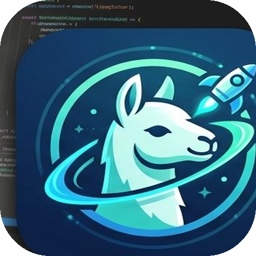
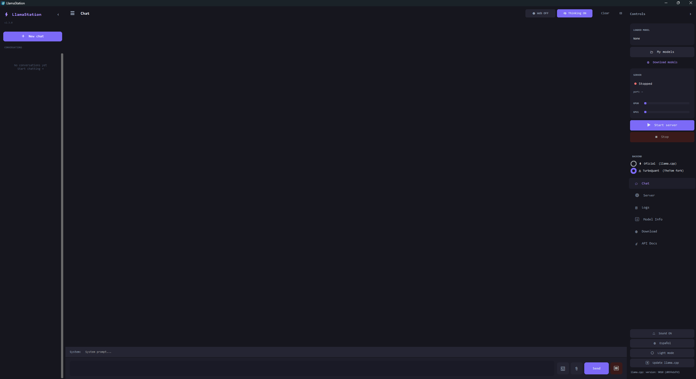
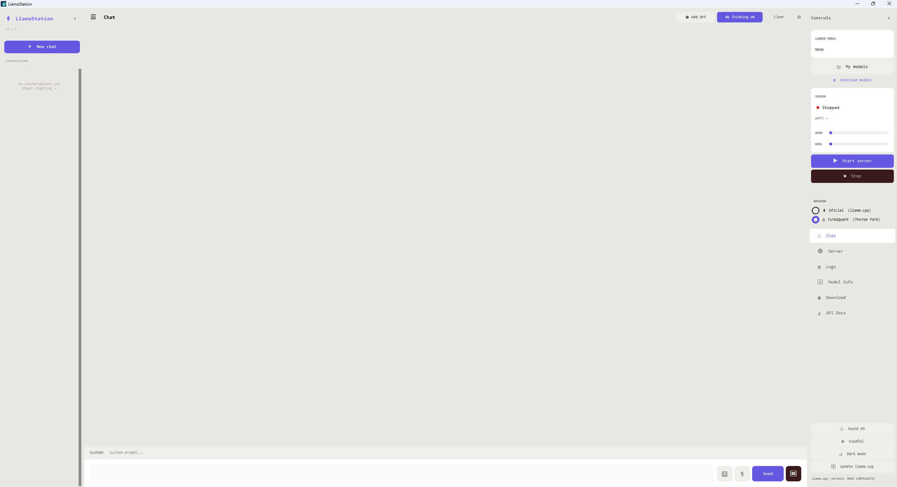
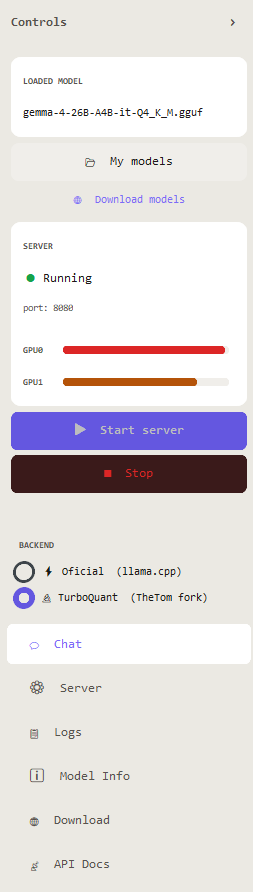
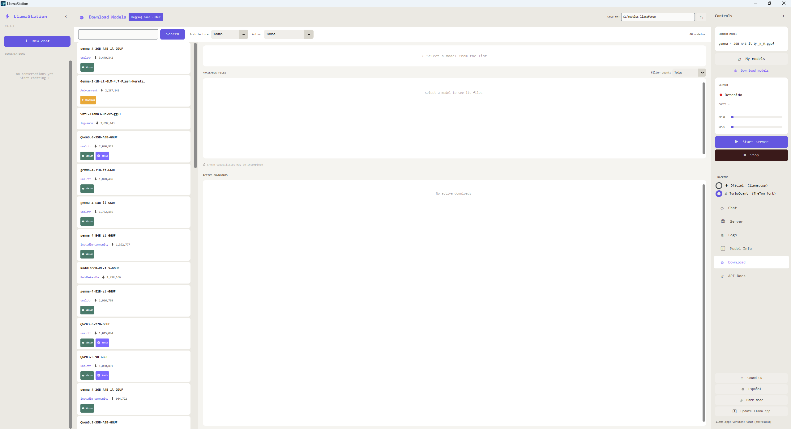
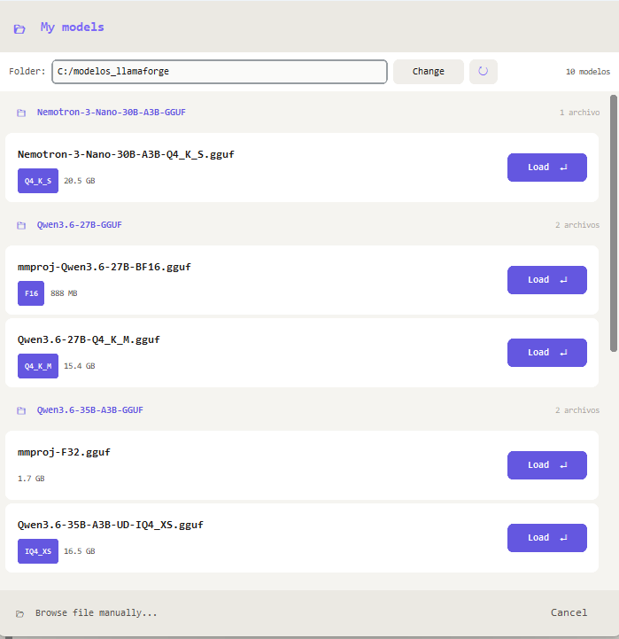

<p align="center">
  
</p>

<h1 align="center">⚡ LlamaStation</h1>
<p align="center"><b>AI Model Workstation — llama.cpp GUI for Windows</b></p>

<p align="center">
  
  
  
  
  
</p>

<p align="center">
  A powerful, open-source GUI for running local AI models via llama.cpp — built for users who want full control over their hardware without the bloat.
</p>

---

## Screenshots

<table>
  <tr>
    <td><br/><sub>Dark mode</sub></td>
    <td><br/><sub>Light mode</sub></td>
  </tr>
  <tr>
    <td><br/><sub>Real-time VRAM meter — dual GPU</sub></td>
    <td><br/><sub>Hugging Face model browser</sub></td>
  </tr>
</table>

<p align="center">
  <br/>
  <sub>Local model browser with quantization info</sub>
</p>

---

## Why LlamaStation?

Most llama.cpp frontends are either too simple or too complicated. LlamaStation gives you **LM Studio-level UX** with **full parameter control** — designed for power users running custom hardware.

- **No telemetry. No accounts. No subscriptions.** 100% local, 100% yours.
- Built specifically for **multi-GPU setups** with per-GPU VRAM monitoring
- Supports both **official llama.cpp** and **TurboQuant fork** (asymmetric KV cache quantization)
- **OpenAI-compatible API** — drop-in replacement for any app that uses OpenAI

---

## Features

### 🖥️ Interface
- Dark / Light mode
- English / Spanish UI (more languages easy to add)
- Collapsible sidebars
- Chat history with session management
- Thinking mode toggle (for reasoning models like Qwen3, DeepSeek-R1)
- Web search via DuckDuckGo (no API key needed)
- Vision support — attach images to chat (multimodal models)
- File attachment — send code files directly to the model

### ⚙️ Model Management
- Load any `.gguf` model with a full parameter modal
- Per-model profile saving — settings remembered automatically
- Auto-detection of mmproj files for vision models
- Local model browser with quantization badges
- Download models directly from Hugging Face with capability tags (Vision, Tools, Thinking, Code...)

### 🔧 Server Control
- Start / stop llama.cpp server with one click
- **Real-time VRAM meter** for each GPU — color coded (green/yellow/red)
- Multi-GPU support: layer split, row split, tensor split ratio
- Continuous batching, Flash Attention, KV cache offload
- Asymmetric KV cache (different types for K and V — TurboQuant)
- Auto-update llama.cpp from GitHub

### 📡 API & Headless
- Built-in API Docs tab with copy-ready curl and Python examples
- **Headless mode** — run without GUI, uses saved model profiles:

```bash
# Interactive model selector
python llama_gui.py --no-gui

# Direct launch
python llama_gui.py --no-gui --model C:\models\qwen3.gguf --port 8080
```

---

## Requirements

- Windows 10/11
- Python 3.10+
- [llama.cpp](https://github.com/ggerganov/llama.cpp) compiled for your hardware (CUDA, Vulkan, CPU)
- NVIDIA GPU recommended (AMD/Intel via Vulkan also supported)

```bash
pip install customtkinter requests Pillow
```

---

## Installation

**Option A — Run from source (recommended for power users)**

```bash
git clone https://github.com/YOUR_USERNAME/llamastation
cd llamastation
pip install customtkinter requests Pillow
python llama_gui.py
```

Or just double-click `iniciar_llamastation.bat` — it installs dependencies and launches automatically.

**Option B — Pre-built .exe**

Download the latest release from the [Releases](../../releases) page, unzip, and run `LlamaStation.exe`.

> ⚠️ Windows SmartScreen may warn about an unknown publisher — this is a false positive. The source code is fully open and auditable. Click "More info" → "Run anyway", or [verify on VirusTotal](https://www.virustotal.com).

---

## Quick Start

1. Download or compile `llama-server.exe` from [llama.cpp releases](https://github.com/ggerganov/llama.cpp/releases)
2. Launch LlamaStation and go to **Server** tab — point it to your `llama-server.exe`
3. Click **My models** → select your `.gguf` file → configure and load
4. Hit **▶ Start server** — the VRAM bars will fill up as the model loads
5. Start chatting

> **Don't have llama.cpp yet?** No problem — use the **⬆ Update llama.cpp** button at the bottom of the sidebar. It downloads and installs the latest official release automatically. On first run it acts as an installer; on subsequent runs it checks for updates.

---

## Multi-GPU Setup (2x RTX 3060, etc.)

LlamaStation has first-class multi-GPU support. In the model load dialog:

- **Split Mode**: `layer` (recommended) splits the model evenly across GPUs by layers
- **Tensor Split**: set a ratio like `1,1` for 50/50 or `3,1` for 75/25
- Watch the **VRAM meter** in real time to verify the split is working

---

## Supported Backends

| Backend | Description |
|---|---|
| ⚡ Official llama.cpp | Standard build — CUDA, Vulkan, CPU |
| 🔬 TurboQuant (TheTom fork) | Asymmetric KV cache quantization — save VRAM with minimal quality loss |

**Adding your own fork** is two lines of code — edit the `BACKENDS` dict in `llama_gui.py` and point it to your `llama-server.exe`. Any fork that compiles from llama.cpp works out of the box.

```python
BACKENDS = {
    "⚡ Official  (llama.cpp)":      r"C:\llama.cpp\llama-server.exe",
    "🔬 TurboQuant  (TheTom fork)":  r"C:\llama-turboquant\llama-server.exe",
    "🧪 My Custom Fork":             r"C:\llama-myfork\llama-server.exe",  # ← add yours
}
```


## API Usage

LlamaStation exposes an OpenAI-compatible API at `http://localhost:8080/v1`. Any app that supports OpenAI works out of the box:

```python
from openai import OpenAI

client = OpenAI(base_url="http://localhost:8080/v1", api_key="no-key")
response = client.chat.completions.create(
    model="local",
    messages=[{"role": "user", "content": "Hello!"}]
)
print(response.choices[0].message.content)
```

See the **API Docs** tab inside the app for more examples.

---

## File Structure

```
llamastation/
├── llama_gui.py              # Main application
├── llamaforge_downloader.py  # HuggingFace model downloader
├── llamaforge_i18n.py        # Translations (ES/EN)
├── llamastation_icon.ico     # App icon
├── iniciar_llamastation.bat  # Windows launcher
├── llamaforge_profiles.json  # Per-model settings (auto-generated)
└── llamaforge_settings.json  # App settings (auto-generated)
```

---

## Adding a Language

Open `llamaforge_i18n.py`, copy the `"en"` block, rename it to your language code (e.g. `"fr"`), translate the values, and open a PR. That's it — no other files need to change.

---

## Contributing

PRs welcome. The codebase is intentionally kept in a small number of files to make it easy to understand and modify. If you add features, please update both `"es"` and `"en"` blocks in `llamaforge_i18n.py`.

---

## Credits & Third-party licenses

LlamaStation is a GUI frontend. The actual inference is powered by these open-source projects:

| Project | Author | License | What it does |
|---|---|---|---|
| [llama.cpp](https://github.com/ggml-org/llama.cpp) | Georgi Gerganov / ggml-org | MIT | Core LLM inference engine (official backend) |
| [llama-cpp-turboquant](https://github.com/TheTom/llama-cpp-turboquant) | TheTom | MIT | llama.cpp fork with TurboQuant KV cache compression (turbo2/3/4) |

TurboQuant is based on the paper [TurboQuant (arXiv:2504.19874, ICLR 2026)](https://arxiv.org/abs/2504.19874) by Zirlin et al.

Both backends are MIT licensed — `Copyright © 2023-2026 The ggml authors`. Full license text is included in the **⚖️ Acerca de** tab inside the app.

---

## License

MIT — do whatever you want with it.

---

<p align="center">
  Made with ❤️ for the local AI community<br/>
  <sub>Not affiliated with Ollama, LM Studio, or any AI company</sub>
</p>
